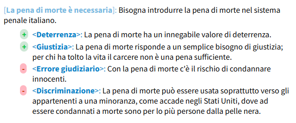

## Gli argomenti

Ogni dichiarazione può essere sostenuta da una serie di argomenti a favore o contrari. Per aggiungere argomenti si procede come segue:
- Si va a capo dopo aver scritto la dichiarazione.
- Si lascia uno spazio per indentare il testo.
- Si inserisce quindi un + per un argomento a favore e un - per un argomento contrario.
- Si inserisce un testo di breve descrizione dell'argomento tra parentesi uncinate (<>), seguito da due punti e il testo dell'argomento.

Si veda questo esempio.

```
[La pena di morte è necessaria]: Bisogna introdurre la pena di morte nel sistema penale italiano.
 + <Deterrenza>: La pena di morte ha un innegabile valore di deterrenza.
 + <Giustizia>: La pena di morte risponde a un semplice bisogno di giustizia; per chi ha tolto 
la vita il carcere non è una pena sufficiente.
 -<Errore giudiziario>: Con la pena di morte c'è il rischio di condannare innocenti.
 -<Discriminazione>: La pena di morte può essere usata soprattutto verso gli appartenenti a una
 minoranza, come accade negli Stati Uniti, dove ad essere condannati a morte sono per lo più persone
dalla pelle nera.
```
Il rendering HTML di questa mappa è il seguente:

<figure>
  
</figure>

Questo è sufficiente per inserire un argmento in una mappa. Tuttavia ogni argomento è la sintesi di un ragionamento più ampio, che può essere ricostruito nel dettaglio. 
Analizziamo il primo argomento contrario: "Con la pena di morte c'è il rischio di condannare innocenti". Esso si basa su un principio di precauzione e giustizia. Vediamo come ricostruirlo logicamente.

Premessa 1: Il sistema giudiziario non è infallibile e possono verificarsi errori giudiziari.
Premessa 2: La pena di morte è irreversibile: una volta eseguita, non è possibile correggere un errore.
Premessa 3: Ci sono casi storici in cui innocenti sono stati giustiziati (es. Sacco e Vanzetti).
Conclusione: Pertanto, la pena di morte comporta il rischio inaccettabile di giustiziare innocenti.

In Argdown possiamo ricostruire questo ragionamento numeriamo tra parentesi tonda ogni argomento e inseriamo quattro trattini brevi prima della conclusione.

```
(1) Il sistema giudiziario non è infallibile e possono verificarsi errori giudiziari.
(2) La pena di morte è irreversibile: una volta eseguita, non è possibile correggere un errore.
(3) Ci sono casi storici in cui innocenti sono stati giustiziati (es. Sacco e Vanzetti).
----
(4) Pertanto, la pena di morte comporta il rischio inaccettabile di giustiziare innocenti.
```

Il rendering HTML è il seguente:

<figure>
  
</figure>

È possibile anche inserire annotazioni relativa al tipo di inferenza inserendole tra due linee prima della conclusione:

```

(3)
----
Modus ponens
----
(4)

```

 


