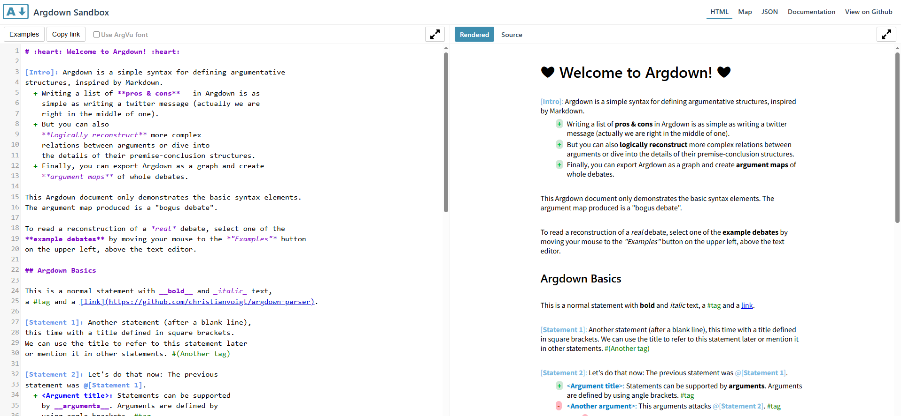

<link rel="stylesheet" href="../assets/style.css">

### Cosa ci serve per cominciare

Per iniziare a usare Argdown non serve avere competenze informatiche avanzate. Il modo più semplice per provarlo è utilizzare la [sandbox](https://argdown.org/sandbox/html) di Argdown}, uno spazio online che permette di scrivere e visualizzare mappe argomentative senza dover installare nulla. Basta aprire il link, scrivere un testo seguendo una sintassi molto intuitiva e vedere immediatamente il risultato in forma grafica.

<figure>
    
    <figcaption>Come si presenta la sandbox di Argdown</figcaption>
</figure>

Per un uso avanzato si raccomanda tuttavia di scaricare e installare Visual Studio Code, un programma gratuito che, con il plugin di Argdown, offre un ambiente più completo per scrivere e analizzare argomentazioni.  

Vedremo in seguito come installare Visual Studio Code e usare il plugin di Argdown.

[Indice](Indice) | [<<](Introduzione.md) | [>>](sintassi.md)
