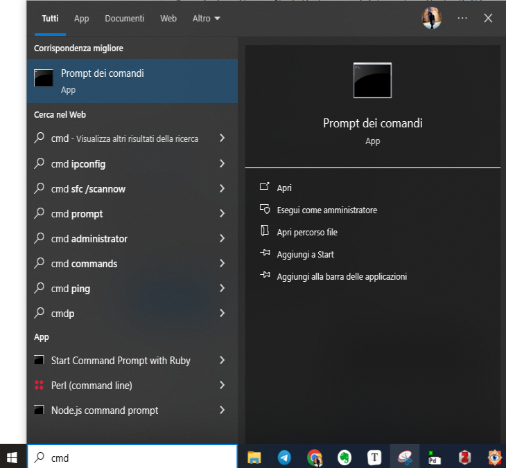

<div class="button orange">
Mappe argomentative
</div>

## Guida a Argdown

### Installare Argdown

#### Installazione su Windows

Per usare Argdown abbiamo bisogno di Node.js. [Wikipedia ci informa](https://it.wikipedia.org/wiki/Node.js) che Node.js è "un runtime system open source multipiattaforma orientato agli eventi per l'esecuzione di codice JavaScript, costruito sul motore JavaScript V8 di Google Chrome". Per fortuna non abbiamo bisogno di capire esattamente cosa significhi; ci è sufficiente sapere che è uno strumento di cui abbiamo bisogno. E che, per fortuna, è molto facile da installare. Ci basta andare [nel sito di Node.js](https://nodejs.org/en/), cliccare su Download Node.js, avviare il file che abbiamo scaricato e seguire le istruzioni.

L'installazione di Argdown avviene invece attraverso riga di comando. Può spaventare chi sia abituato a installare software cliccando su un file .exe, ma in realtà è una procedura estremamente semplice.
Vediamo come fare passo dopo passo.

Apriamo il menu Start (in basso a sinistra sul monitor), digitiamo cmd e premiamo Invia. 
<figure>
  
</figure>

Nella finestra che si apre digitiamo

```
npm install -g @argdown/cli
```

Questo è sufficiente per installare Argdown. Per verificare che l'installazione sia andata a buon fine, digitiamo ancora:

```
argdown --version
```

Se l'installazione è andata a buon fine, si vedrà la versione di Argdown.

