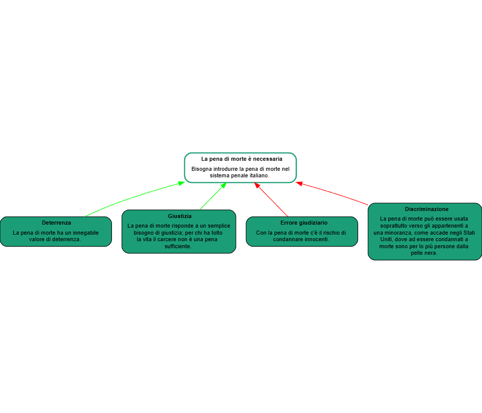
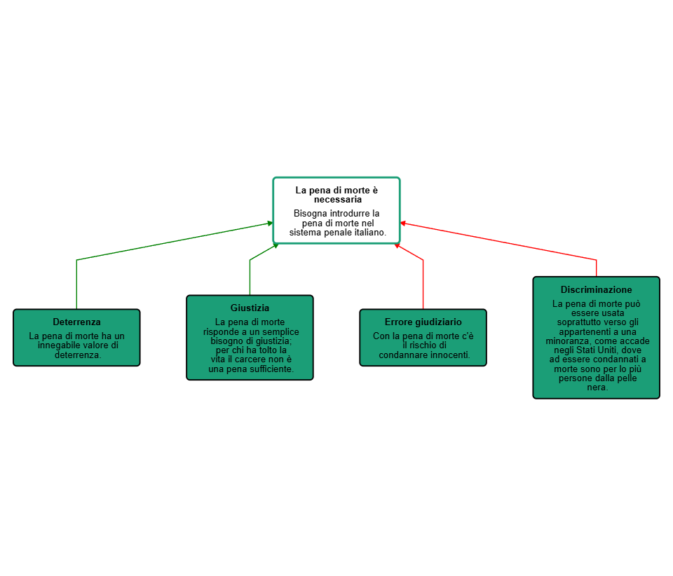

## Guida a Argdown

### Le mappe grafiche

Fino ad ora abbiamo considerato il rendering HTML del codice. Cliccando sulla voce di menu _Map_, in alto a destra, accediamo al rendering grafico del codice.
È possibile visualizzare la mappa in due formati grafici, Viz Js e Dagre D3, due librerie JavaScript che danno risultati grafici un po' diversi.
La nostra mappa sula pena di morte si presenta in questo modo nel formato Viz Js:

<figure>
  
</figure>

Questo invece è il rendering in Dagre D3:

<figure>
  
</figure>

Come si vede, gli argomenti a favore della dichiarazione sono collegati ad essa da linee verdi che terminano con una freccia, mentre quelli contrari sono collegati da linee rosse.

È possibile modificare l'aspetto delle linee e la risposizione dei box modificando il codice.

