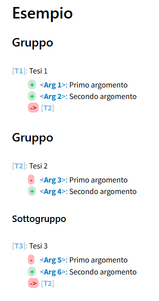
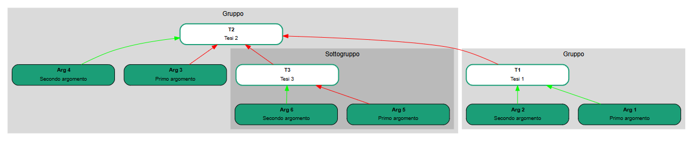

<div class="button orange">
Mappe argomentative
</div>

## Guida a Argdown

### Raggruppare gli elementi

Osserviamo questo esempio:

```
# Esempio

## Gruppo

[T1]: Tesi 1
 + <Arg 1>: Primo argomento
 + <Arg 2>: Secondo argomento
 -> [T2]

## Gruppo

[T2]: Tesi 2
 - <Arg 3>: Primo argomento
 + <Arg 4>: Secondo argomento

### Sottogruppo

[T3]: Tesi 3
 - <Arg 5>: Primo argomento
 + <Arg 6>: Secondo argomento
 -> [T2]
```
Il rendering HTML è il seguente:

<figure>
  
</figure>

La mappa grafica invece si presenta come segue:

<figure>
  
</figure>

Come si vede, gli elementi ora sono raggruppati. Ci sono due gruppi, uno dei quali include un sottogruppo. Per ottenere questo risultato grafico Argdown fa uso della sintassi usata per formattare i titoli in Markdown. Come abbiamo già visto, per un titolo generale si usa `# Titolo`, mentre per un titolo di paragrafo si ricorre a un doppio cancelletto, `## Titolo del paragrafo` e a tre cancelletti per il titolo di un sottoparagrafo, `### Titolo sottoparagrafo`. In Argdown questi titoli strutturano la mappa in gruppi e sottogruppi.

Si noti la freccia rossa che va da T1 e T3 a T2. È stata ottenuta semplicemente scrivendo `-> [T2]` nelle tesi 1 e 3. 

[Indice](index.md) | [<<](mappa-grafiche.md)  

