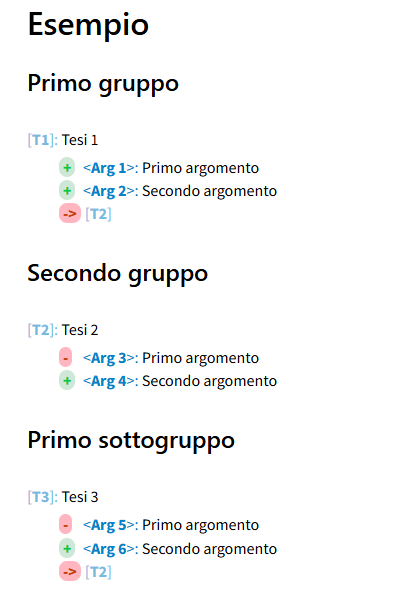
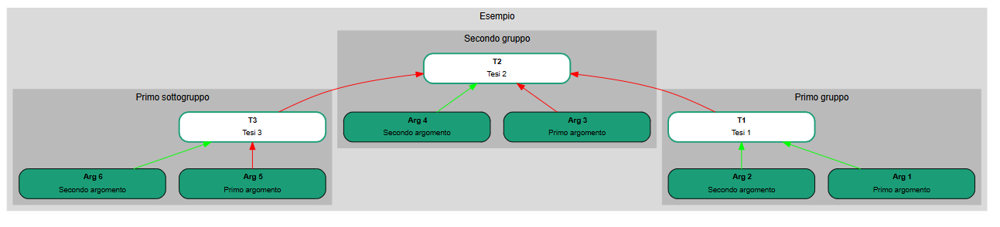

## Raggruppare gli elementi

Osserviamo questo esempio:

```
# Esempio

## Primo gruppo

[T1]: Tesi 1
 + <Arg 1>: Primo argomento
 + <Arg 2>: Secondo argomento
 -> [T2]

## Secondo gruppo

[T2]: Tesi 2
 - <Arg 3>: Primo argomento
 + <Arg 4>: Secondo argomento

## Primo sottogruppo

[T3]: Tesi 3
 - <Arg 5>: Primo argomento
 + <Arg 6>: Secondo argomento
 -> [T2]
```
Il rendering HTML è il seguente:

<figure>
  
</figure>

La mappa grafica invece si presenta come segue:

<figure>
  
</figure>
