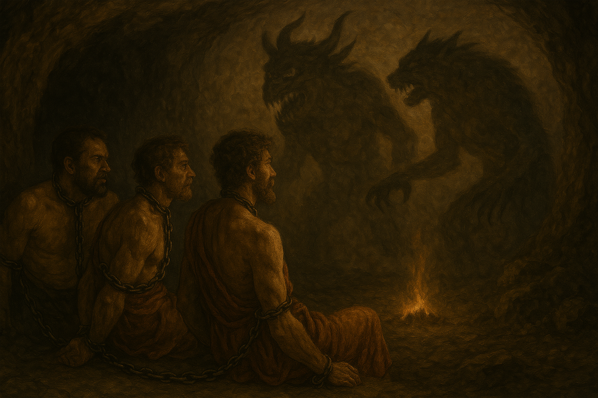

## L'IA per la creazione di immagini

Nel contesto dell’insegnamento della filosofia, l’intelligenza artificiale può essere utilizzata anche per la generazione di immagini a partire da descrizioni testuali. Questa possibilità può risultare utile in diverse fasi del lavoro didattico, in particolare quando si desidera rappresentare visivamente concetti o scenari teorici che, per loro natura, non si prestano a essere osservati direttamente.

Ad esempio, è possibile chiedere all’IA di creare un’immagine che rappresenti l’allegoria della caverna di Platone, oppure di raffigurare un’ipotesi di “stato di natura” ispirata a Hobbes o a Rousseau. L’immagine prodotta, che non è una fotografia ma una costruzione artificiale basata su una descrizione verbale, può servire come punto di partenza per una discussione collettiva: si può riflettere su quanto essa restituisca fedelmente le idee presenti nel testo, su quali aspetti siano stati evidenziati o trascurati, e su come il passaggio dal discorso filosofico alla visualizzazione modifichi il modo di comprendere il concetto.

Un’attività analoga può essere proposta agli studenti come esercizio individuale o di gruppo. Dopo aver lavorato su un tema filosofico – ad esempio la concezione dell’uomo in Cassirer o la struttura dell’universo nella filosofia stoica – si può chiedere di formulare una descrizione sintetica e precisa da fornire all’IA per la generazione dell’immagine. Successivamente, si può avviare un lavoro di analisi e commento dell’immagine prodotta, considerandola come una “interpretazione visiva” da discutere criticamente.

Anche nei compiti a casa, la generazione di immagini può costituire una modalità alternativa di rielaborazione concettuale. Gli studenti possono essere invitati a sintetizzare una posizione teorica sotto forma di scena o simbolo, utilizzando l’IA per produrne una rappresentazione visiva e accompagnandola con una spiegazione scritta. L’attività permette di esercitare la capacità di astrazione e di sintesi, oltre a sollecitare un confronto tra linguaggio verbale e figurativo.

Pur non essendo centrale nella didattica della filosofia, l’uso dell’IA per generare immagini può offrire un supporto utile in alcuni contesti, soprattutto quando si lavora su metafore, concetti complessi o visioni del mondo difficili da restituire con le sole parole. L’aspetto più interessante, in questi casi, non è l’immagine in sé, ma il processo di descrizione, selezione e interpretazione che essa attiva.

Nella generazione di immagini con IA, di grande importanza è in _promtp_, ossia il testo che descrive l'immagine dal generare. Un promp elaborato e dettagliato darà un'immagine migliore. La valutazione del lavoro dello studente può tener conto proprio del prompt usato (ma è da tener conto che l'IA stessa può elaborare prompt complessi).

La seguente immagine di esempio, riguardante il mito della caverna (la cosa più scontata da chiedere a una IA), ha richiesto sei tentativi, ed è lontana dall'essere perfetta.

<figure>
  
</figure>
