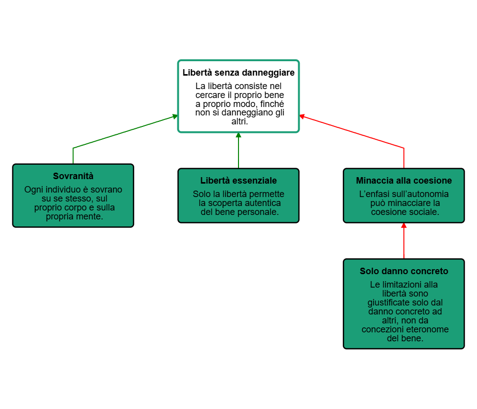

<link rel="stylesheet" href="../assets/style.css">

Mappe argomentative

## Le mappe argomentative

### Cosa sono le mappe argomentative

Le mappe argomentative sono strumenti grafici che permettono di rappresentare visivamente la struttura logica di un ragionamento. A differenza delle mappe concettuali, che si limitano a mostrare le relazioni tra concetti, le mappe argomentative si focalizzano sulla connessione tra enunciati e sulla dinamica inferenziale che sorregge un'argomentazione. In ambito filosofico questo tipo di mappatura è particolarmente utile perché consente di rendere esplicita la struttura spesso complessa del pensiero dell'autore, evidenziando le tesi principali, le argomentazioni a sostegno, le obiezioni e le risposte a tali obiezioni.

Dal punto di vista didattico le mappe argomentative rispondono a diverse finalità. In primo luogo, svolgono una funzione epistemologica, poiché permettono agli studenti di comprendere come si sviluppa un ragionamento filosofico e di riconoscere i legami logici tra le sue parti. In secondo luogo possiedono una valenza formativa: stimolano il pensiero critico, la capacità di analisi, la precisione espressiva e l’abitudine alla valutazione razionale delle idee.

### Parti di una mappa argomentativa

Una mappa argomentativa è composta da vari elementi che interagiscono tra loro in modo gerarchico e logico. Al centro di tutto si trova la tesi, ovvero l’enunciato che costituisce il nucleo del ragionamento. Attorno a questa tesi si dispongono gli argomenti che la sostengono: ogni argomento rappresenta una ragione, un'evidenza o un principio che giustifica la validità della tesi proposta. In alcuni casi gli argomenti possono essere sostenuti da sottopremesse o da inferenze intermedie, formando catene più complesse.

Accanto agli argomenti, una buona mappa argomentativa contempla anche i controargomenti, ossia le obiezioni che si possono muovere alla tesi o ai suoi argomenti. La presenza di controargomentazioni arricchisce il quadro, dimostrando che il ragionamento non è unilaterale, ma tiene conto delle possibili critiche. Infine, le confutazioni rappresentano le risposte che si possono offrire alle obiezioni, nel tentativo di difendere la tesi iniziale. Questi elementi sono legati tra loro da frecce o connettori logici che indicano la direzione dell’inferenza o il tipo di relazione (per esempio: "perché", "quindi", "tuttavia").

### Come costruire una mappa argomentativa

Il primo passo consiste nell’identificare con chiarezza la tesi che si intende sostenere, confutare o discutere. Questa tesi deve essere espressa in modo chiaro e sintetico, evitando formulazioni vaghe o ambigue (con alcuni strumenti, come vedremo, è possibile aggiungere a margine del testo di approfondimento=. Una volta definita la tesi si individuano gli argomenti a suo sostegno. Ogni argomento dev’essere formulato come un enunciato autosufficiente, che spieghi perché la tesi dovrebbe essere considerata vera o plausibile. È importante evitare che gli argomenti siano semplici ripetizioni della tesi o affermazioni generiche: devono contenere una ragione, una prova, un esempio rilevante.

A questo punto si possono introdurre i controargomenti, cioè le possibili obiezioni alla tesi o a uno o più argomenti. Anche in questo caso, ogni controargomento va espresso con precisione e deve avere un senso compiuto, in grado di mettere in crisi la posizione iniziale. Infine, si possono aggiungere le confutazioni, ovvero le risposte che difendono la tesi nonostante le obiezioni: queste completano la struttura argomentativa e ne mostrano la robustezza.

La rappresentazione grafica deve riflettere la struttura logica del ragionamento: al centro o in alto si colloca la tesi, da cui si diramano gli argomenti a favore; in posizione laterale o discendente si pongono i controargomenti e le confutazioni, secondo uno schema ad albero. È essenziale che le relazioni siano chiare e visivamente leggibili, evitando mappe troppo intricate o sovraccariche. Le frecce o i connettori devono esplicitare il tipo di legame (supporto, obiezione, risposta).

### Uso della mappa argomentativa nell’analisi del testo filosofico

L’utilizzo della mappa argomentativa nell’analisi del testo filosofico permette di passare da una comprensione superficiale o narrativa a una comprensione strutturale e critica. In primo luogo, la mappa consente di segmentare il testo in unità logiche, isolando tesi, argomenti, esempi, obiezioni e repliche. Questa segmentazione facilita la comprensione anche dei testi più complessi, come quelli di Kant o Hegel, in cui la densità concettuale può disorientare lo studente.

Attraverso la mappatura si può ricostruire la logica dell’autore, rendendo evidenti i nessi inferenziali che uniscono le varie parti del discorso. Inoltre, la mappa offre un supporto visivo che facilita la memorizzazione e la successiva rielaborazione, permettendo allo studente di riformulare con parole proprie l’argomentazione del filosofo. Questo esercizio sviluppa non solo la comprensione del testo, ma anche la capacità di espressione e la competenza argomentativa.

La mappa può essere utilizzata anche per l’analisi critica: una volta ricostruita l’argomentazione dell’autore, lo studente può valutarne la forza logica, riconoscere eventuali fallacie o presupposti impliciti, proporre controargomentazioni e riflessioni personali. In questo modo, l’analisi del testo non si limita a un esercizio di comprensione, ma si trasforma in un laboratorio di pensiero critico.

Esempio: Mappa argomentativa da un passo di John Stuart Mill

Prendiamo in esame un celebre passo di John Stuart Mill, tratto da _Sulla libertà_:

>La sola libertà che merita questo nome è quella di cercare il nostro bene a nostro modo, finché non priviamo gli altri del loro o impediamo loro di procurarselo. [...] L’individuo è sovrano su se stesso, sul proprio corpo e sulla propria mente.

In questo brano, la tesi principale è che la libertà autentica consista nel poter perseguire il proprio bene in modo autonomo, a patto di non ledere la libertà altrui. Questa tesi è sostenuta da due argomenti principali: il primo è di natura morale e si basa sull’idea di sovranità individuale; il secondo è di natura pratica e suggerisce che solo la libertà individuale permette la realizzazione del bene autentico.

A questa tesi si può opporre il controargomento secondo cui un’eccessiva enfasi sull’autonomia individuale potrebbe minacciare la coesione sociale o la tutela dei più deboli. La confutazione possibile, implicita nel pensiero di Mill, è che ogni limitazione della libertà deve essere giustificata da un danno concreto ad altri, non da una concezione paternalistica del bene comune.

La mappa argomentativa potrebbe quindi essere strutturata visivamente in questo modo:[^1]

<figure>
 
</figure>

### Uso delle mappe argomentative nella discussione in classe

Le mappe argomentative possono essere usate in diversi modi come strumento per la discussione in classe. In docente può costruire alla Lim la mappa argomentativa raccogliendo gli argomenti e i controargomenti degli studenti. Quando la mappa è completa, si può passare all'analisi e alla valutazione della forza di tutti gli argomenti.

Per questo scopo si possono usare strumenti come MindMup AV o Argdown. Un uso più attivo e coinvolgente è consentito da Kialo-edu. In questo caso gli studenti inserisco autonomamente le loro argomentazioni e interagiscono con i propri compagni; la discussione si sposta online e si struttura visivamente man mano che cresce. 

[^1]: Mappa creata con Argdown.

