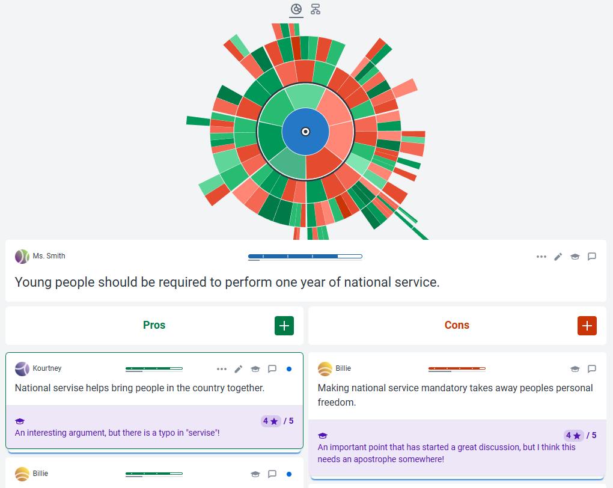
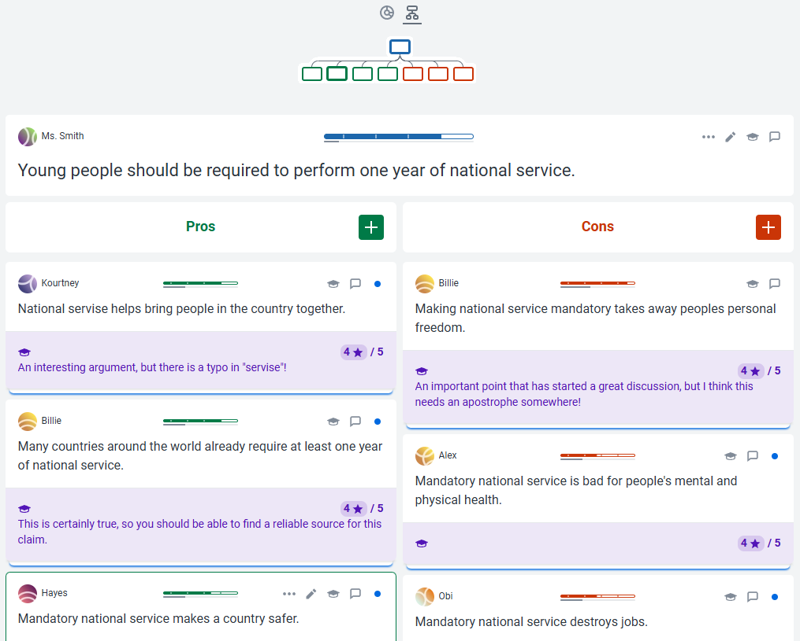

<link rel="stylesheet" href="../assets/style.css">

Mappe argomentative

## Guida a Kjalo-Edu

[Kialo](https://www.kialo.com) è una piattaforma online creata nel 2017 de Errikos Pitsos, laureato alla London School of Economics and Political Science. 
Kialo permette agli utenti di analizzare un'affermazione centrale (la tesi) e di sviluppare una rete di argomentazioni pro e contro, disposte in modo gerarchico e facilmente navigabile. Ogni argomento può essere supportato o confutato da altri argomenti, creando una struttura ad albero che aiuta a visualizzare la logica e le connessioni tra le idee. La piattaforma è pensata per mantenere il confronto ordinato, collaborativo e focalizzato sui contenuti, evitando le derive polemiche tipiche dei social.

[Kialo Edu](https://www.kialo-edu.com) è la versione educativa di Kialo, sviluppata appositamente per l'uso in contesti scolastici e universitari. Offre agli insegnanti un ambiente sicuro e controllato dove gli studenti possono esercitarsi nel costruire e valutare argomentazioni, partecipare a discussioni strutturate, analizzare testi o prepararsi a dibattiti.

Sia Kialo che Kialo-Edu sono interamente gratuiti e liberi da pubblicità.

Dopo essersi registrati è possibile esplorare una discussione di esempio in inglese. Il tema è: "I giovani dovrebbero essere obbligati a svolgere un anno di servizio nazionale."
La discussione si presenta come segue:

<figure>
  
</figure>

I cerchi concentrici raffigurano in modo sintetico ed efficace lo sviluppo della discussione: nel primo cerchio sono inclusi i primi argomenti a favore (verdi) e contrari (rossi), nel secondo cerchio i primi contro-argomenti e così via.

È possibile impostare una diversa visualizzazione abilitando la navigazione ramificata. Si ottiene la seguente schermata: 

<figure>
  
</figure>

Come si vede, gli studenti, individuati con il loro nome (Kourtney, Billie, Hayes ecc.) hanno inserito i loro argomenti a favore o contro. Il docente è intervenuto, nell'area in basso. Clicchiamo sul primo commento a sinistra, quello si Kourtney. Si apre questa finestra:

<figure>
  
</figure>

Il docente può commentare l'argomento dello studente (in questo caso osservando che l'argomento è interessante, ma notando un errore di battitura) e dando ad esso un voto (in questo caso 4 su 5).

Per dare un feedback e assegnare un voto occorre cliccare sull'icona del cappello accademico, in alto a destra. Si apre questa finestra:

<figure>
  
</figure>

