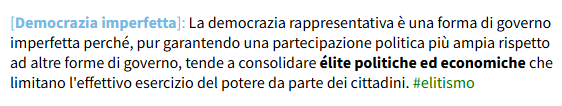

<link rel="stylesheet" href="https://antonio-vigilante.github.io/filosofia/assets/style.css">

<div class="button orange">
Mappe argomentative
</div>

## Guida a Argdown

### Le dichiarazioni 

Entriamo quindi nella [sandbox](https://argdown.org/sandbox/html). Troviamo nella finestra a sinistra del codice, che viene elaborato (_rendering_) nella finestra a destra.  

Dopo una breve presentazione, ci troviamo di fronte al seguente testo che fornisce alcune basi di Argdown:


```
 
## Argdown Basics

This is a normal statement with __bold__ and _italic_ text, 
a #tag and a [link](https://github.com/christianvoigt/
argdown-parser).

[Statement 1]: Another statement (after a blank line), 
this time with a title defined in square brackets. 
We can use the title to refer to this statement later 
or mention it in other statements. #(Another tag)

[Statement 2]: Let's do that now: The previous 
statement was @[Statement 1].
  + <Argument title>: Statements can be supported 
    by __arguments__. Arguments are defined by 
    using angle brackets. #tag
  - <Another argument>: This arguments attacks
  @[Statement 2]. #tag
    - <Yet another argument>: Arguments can also 
      be supported or attacked. #yet-another-tag

 ```

Nelle prime righe ci sono forniti alcuni semplici elementi del **markdown**, cui Argdown si ispira e che ingloba per la formattazione del testo.

<div class="info-box">
Il <b>markdown</b> è un linguaggio di markup leggero creato da John Gruber nel 2004 con lo scopo di fornire un modo semplice e intuitivo per scrivere testi formattati. La sua sintassi è progettata per essere leggibile anche in formato plain text, rendendolo ideale per la scrittura di documentazione, blog, note e contenuti web. La sua semplicità lo rende accessibile anche a chi non ha esperienza con linguaggi di markup più complessi come HTML o LaTeX. Alcune fomattazioni del testo (corsivo, grassetto, barrato, sottolineato) sono supportate anche dalla popolare app di messagistica WhatsApp.
</div>


Molto semplicemente, per scrivere del testo in corsivo è sufficiente inserire un trattino basso prima e dopo la parola, (`_testo_`); per ottenere un testo in grassetto, il trattino basso dovrà essere doppio (`__testo__`), per taggare una parola useremo l'asterisco (`#testo`), mentre per collegare una parola ad un link faremo così: `[parola](https://www.sitointernet.com)`.

Sappiamo dunque, da queste prime righe, che per creare uno **statement**, ossia una **dichiarazione**, possiamo semplicemente scrivere del testo, formattandolo se occorre nel modo indicato e, se vogliamo, aggiungendo dei tag. Possiamo però anche dare un titolo o nome alla nostra tesi usando le parentesi quadre seguite da due punti. Possiamo usare corsivo o grassetto o inserire link, secondo le regole del Markdown che abbiamo visto. Se lo riteniamo utile, possiamo anche aggiungere un tag.

 ```
[Democrazia imperfetta]: La democrazia rappresentativa è una forma di governo imperfetta perché, 
pur garantendo una partecipazione politica più ampia rispetto ad altre forme di governo, 
tende a consolidare **élite politiche ed economiche** che limitano l'effettivo esercizio 
del potere da parte dei cittadini. #elitismo

 ```
Il rendering HTML di questo codice è il seguente:

<figure>
    
 </figure>

[Indice](index.md) | [<<](cominciare.md) | [>>](argomenti.md)


