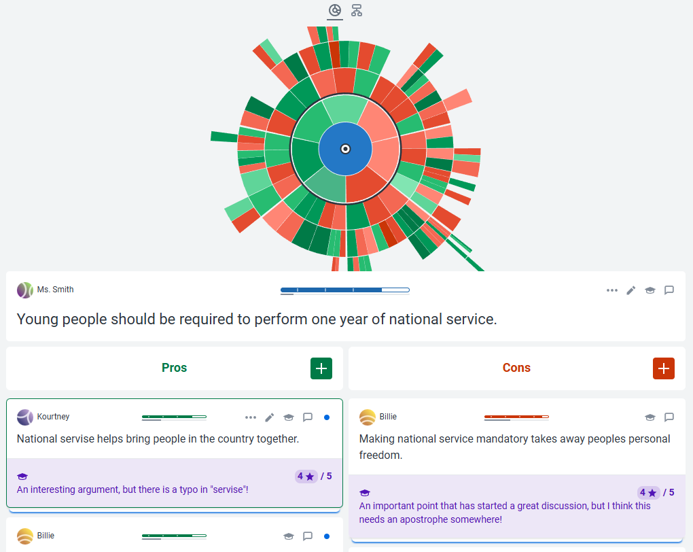
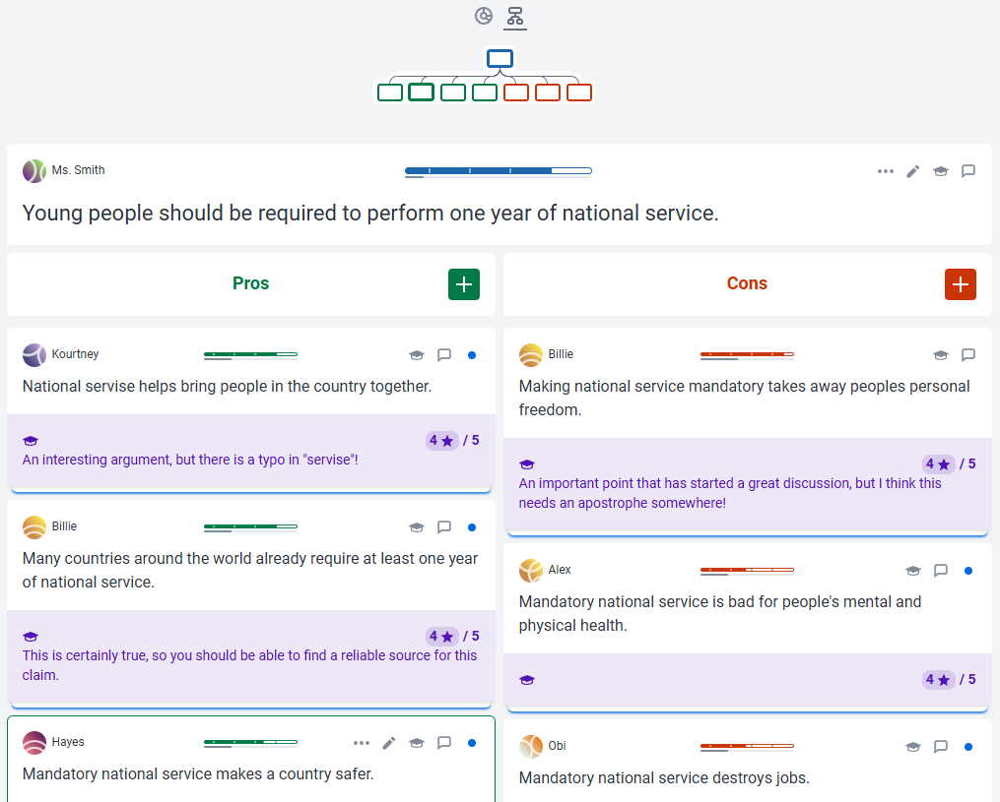
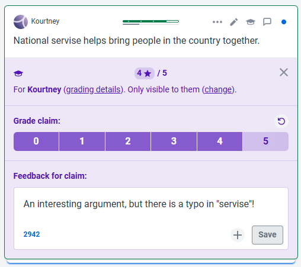
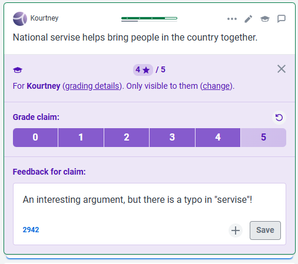
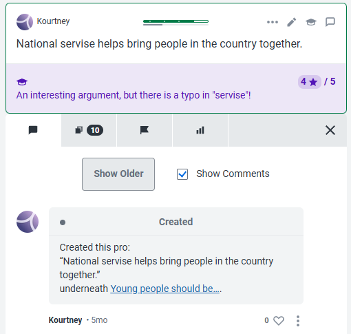

<link rel="stylesheet" href=".../assets/style.css">

Mappe argomentative

## Guida a Kjalo-Edu

[Kialo](https://www.kialo.com) è una piattaforma online creata nel 2017 de Errikos Pitsos, laureato alla London School of Economics and Political Science. 
Kialo permette agli utenti di analizzare un'affermazione centrale (la tesi) e di sviluppare una rete di ragioni pro e contro, disposte in modo gerarchico e facilmente navigabile. Ogni ragione può essere supportato o confutato da altre ragioni, creando una struttura ad albero che aiuta a visualizzare la logica e le connessioni tra le idee. La piattaforma è pensata per mantenere il confronto ordinato, collaborativo e focalizzato sui contenuti, evitando le derive polemiche tipiche dei social.

[Kialo Edu](https://www.kialo-edu.com) è la versione educativa di Kialo, sviluppata appositamente per l'uso in contesti scolastici e universitari. Offre agli insegnanti un ambiente sicuro e controllato dove gli studenti possono esercitarsi nel costruire e valutare ragioni, partecipare a discussioni strutturate, analizzare testi o prepararsi a dibattiti.

Sia Kialo che Kialo-Edu sono interamente gratuiti e liberi da pubblicità.

Dopo essersi registrati è possibile esplorare una discussione di esempio in inglese. Il tema è: "I giovani dovrebbero essere obbligati a svolgere un anno di servizio nazionale."
La discussione si presenta come segue:

<figure>
  
</figure>

I cerchi concentrici raffigurano in modo sintetico ed efficace lo sviluppo della discussione: nel primo cerchio sono incluse le prime ragioni a favore (verdi) e contrari (rossi), nel secondo cerchio le prime obiezioni e così via.

È possibile impostare una diversa visualizzazione abilitando la navigazione ramificata. Si ottiene la seguente schermata: 

<figure>
  
</figure>

Come si vede gli studenti, individuati con il loro nome (Kourtney, Billie, Hayes ecc.) hanno inserito le loro ragioni a favore o contro. Il docente è intervenuto, nell'area in basso. Clicchiamo sul primo commento a sinistra, quello di Kourtney. Si apre questa finestra:

<figure>
  
</figure>

Il docente può commentare la ragione dello studente (in questo caso osservando che la ragione è interessante, ma notando un errore di battitura) e dando ad esso un voto (in questo caso 4 su 5).

Per dare un feedback e assegnare un voto occorre cliccare sull'icona del cappello accademico, in alto a destra. Si apre questa finestra:

<figure>
  
</figure>

Cliccando sull'icona con la matita, accanto a quella con il cappello accademico, abbiamo la possibilità di editare il _claim_, ossia la ragione dello studente. La piattaforma mostra anche le possibili ragioni duplicate (_duplicate claims_). Questa lista compare anche in fase di scrittura della ragione, e serve ad avvisare lo studente che quello che sta scrivendo è già stato detto da altri.

Se clicchiamo ancora sull'icona con il callout, a destra dell'icona con il cappello accademico, si apre questa finestra:

<figure>
  
</figure>

Abbiamo qui quattro icone. La prima a sinistra (ancora un callout) mostra i commenti e le diverse modifiche fatte nel tempo, mentre l'icona accanto consente nuovamente di visualizzare le ragioni duplicate. L'icona con la bandierina permette di contrassegnare la ragione come necessaria di revisione da parte dello studente, per una delle seguenti ragioni:
- Unsupported: La ragione non è supportata (senza spiegazione, senza dati, senza esempi).
- Not a claim: Quella dello studente non è una vera ragione.
- Unclear: La ragione è poco chiara.
- Vulgar/Abusive: La ragione è espressa in modo inaccettabile.
- Duplicate claim: La ragione è uguale a una espressa già da qualche altro studente.
- Unrelates: La ragione non è legata a ciò di cui si sta discutendo.
- Move elsewhere: La ragione va spostata in un'altra parte della discussione. Le ragioni possono essere spostate semplicemente trascinandole nella nuova destinazione.
- More than one claim: In ciò che ha scritto lo studente è presente più di una ragione.
  
L'ultima icona, con le tre linee graduate, ci consente di visualizzare l'esito del voto dei compagni, nel caso in cui questa funzione sia stata attivata.

