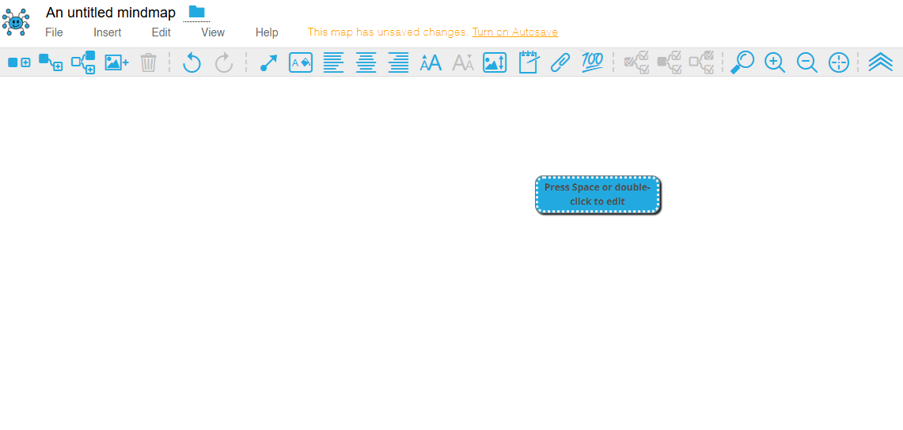
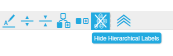
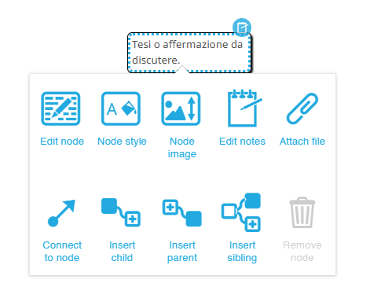
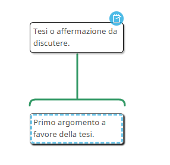
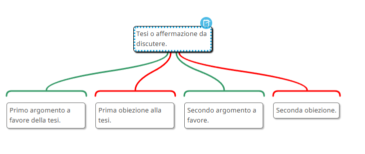
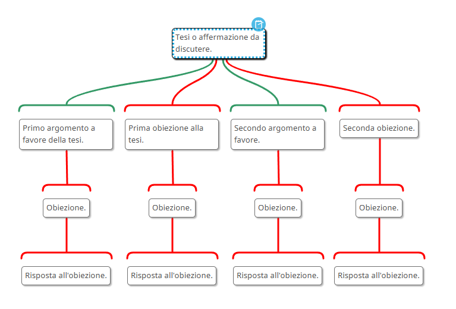
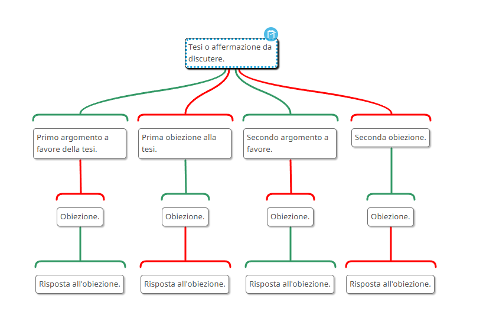
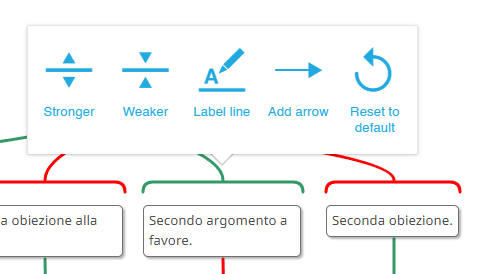
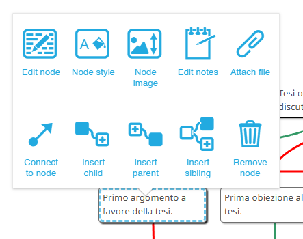
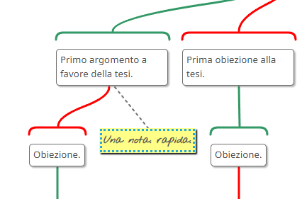

<link rel="stylesheet" href="../assets/style.css">

## MindMup

### Cos'è MindMup AV

_MindMup 2_ è uno strumento online per la creazione di mappe mentali, sviluppato da Gojko Adzic. Offre un’interfaccia intuitiva per organizzare idee e progetti in modo visivo, con funzionalità come l’integrazione con Google Drive, la collaborazione in tempo reale e l’esportazione in vari formati (PDF, PNG, testo). MindMup è disponibile in una versione gratuita con funzionalità di base e una versione a pagamento (MindMup Gold) per esigenze avanzate. Lo strumento è rilasciato con licenza open source ed è accessibile all’indirizzo https://www.mindmup.com.

_MindMup Argument Visualization (MAV)_ è una versione della piattaforma adattata alla creazione di mappe argomentative, sviluppata [in collaborazione con Simon Cullen della Princeton University](https://dailynous.com/2017/06/01/visualizing-logical-structure-arguments-new-platform-guest-post-simon-cullen/). Si tratta di una piattaforma particolarmente utile per un primo approccio alla creazione di mappe argomentative, perché è gratuita, è facile da utilizzare e si integra con Google Drive. La piattaforma è in lingua inglese, ma dovrebbe essere intuitiva anche per chi non conosca la lingua.

### Primi passi

Entrati [nel sito](https://www.mindmup.com/tutorials/argument-visualization.html?orig=/) abbiamo due possibilità: possiamo creare una mappa con MindMup Gold oppure su Google Drive. Nel primo caso, le nostre mappe saranno pubbliche; per renderle private bisognerà sottoscrivere un abbonamento a MindMup Gold. È senz'altro preferibile creare le mappe salvandole sul nostro Google Drive. 
Questa è l'area di lavoro.
<figure>

</figure>

Al centro abbiamo un box con la scritta "Press Space or double-click to edit". Seguendo l'invito clicchiamo due volte e il testo diventa editabile. Qui possiamo inserire la tesi, affermazione o posizione che vogliamo discutere; clicchiamo fuori dal box per terminare la modifica. Il box ha il alto a destra un numerino: 1.1. Di default, MAV assegna dei numeri ai box per ordinarli gerarchicamente: 1.1 è la tesi, 2.1, 2.2 eccetera sono gli argomenti, 3.1, 3.2 i sottoargomenti e così via. Se si desidera eliminare questa numerazione, per avere una mappa più pulita, è sufficiente selezionare "Hide Hierarchichal Labels" in alto a destra.

<figure>

</figure>

Cliccando con il tast destro sul box si apre un menu con diverse opzioni.

<figure>

</figure>

Possiamo editare il box (_node_), ossia modificare il testo che abbiamo appena inserito; possiamo cambiare lo stile, scegliendo il font, il colore dello sfondo, del testo e del bordo e la forma più o meno arrotondata del box; possiamo caricare una immagine da affiancare al testo e, funzione particolarmente interessante, possiamo aggiungere una nota. Selezionando _Edit notes_ si apre una sidebar nella quale è possibile inserire del testo in cui presentare in modo più approfondito il tema di discussione.

### Ragioni e obiezioni

Ora che abbiamo la tesi possiamo procedere ad inserire gli argomenti a favore (_reason_) e le obiezioni. Dopo aver selezionato il box con la tesi, passiamo il mouse sulla mano con il pollice in su nel menu in alto a destra. Compare il testo "Add a reason".

<figure>

</figure>

Cliccando, compare una linea verde verticale e si apre un box con un cursore che lampeggia e ci consentirà di inserire il testo dell'argomento a favore.

<figure>

</figure>

Per aggiungere una obiezione, selezioniamo la mano con il pollice verso. Comparirà una linea rossa e si aprirà un box in cui inserire l'obiezione.
Possiamo aggiungere dunque le nostre ragioni e favore e contro la tesi, con limiti dettati solo dalla leggibilità della mappa.

<figure>

</figure>

Questo è il primo livello della mappa. È possibile creare un secondo livello aggiungendo obiezioni agli argomenti favorevoli o contrari del primo livello. Per farlo, selezioniamo il box con l'argomento e procediamo come abbiamo fatto in precedenza. È possibile procedere allo stesso modo per creare un terzo, un quarto livello e così via.
<figure>

</figure>

Come si vede, questo modo di procedere crea però un problema di leggibilità della mappa. Poiché discutere vuol dire fare obiezioni, le linee rosse finiscono per diventare presto prevalenti, e a colpo d'occhio è difficile trovare gli argomenti a favore della tesi e quelli contrari. Un modo per rendere la mappa più leggibile è quello di inserire sempre come _reason_ (pollice su) gli argomenti che sono a favore della tesi, anche quando sono obiezioni. La mappa precedente in questo caso si presenta come segue.

<figure>

</figure>

### Formattazione della mappa

Cliccando su uno dei nodi della mappa apriamo il menu seguente.

<figure>

</figure>

Selezionando _Stronger_ possiamo aumentare lo spessore della linea, mentre con _Weaker_ la rendiamo più sottile. Interessante è la voce _Label line_. Selezionandola si apre una finestra di testo, che ci consente di inserire del testo, ad esempio per specificare il legame tra la tesi e l'argomento. L'ultima voce, _Add arrow_, ci consente di aggiungere una freccia. Di base, la freccia punta verso il box con l'argomento, ma è possibile selezionare una freccia che punti verso la tesi o ancora fare in modo che vi siano frecce alle due estremità della linea.

Selezionando invece il box con l'argomento, si apre questo menu.

<figure>

</figure>

Oltre a modificare l'aspetto del box, ad esempio impostando un colore dello sfondo, possiamo allegare un file oppure aggiungere una nota selezionando _Edit notes_; in questo caso si aprirà la sidebar, come abbiamo visto in precedenza.

Possiamo aggiungere una nota rapida - una sorta di post-it - selezionando _Add sticky note_ nel menu in alto a destra.

<figure>

</figure>

<figure>

</figure>

