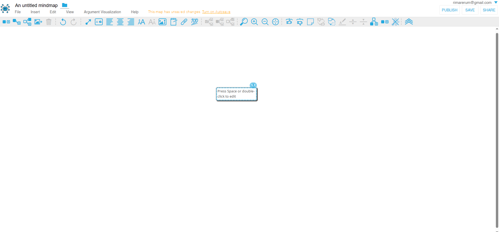

<link rel="stylesheet" href="../assets/style.css">

## Mindmup

 ### Presentazione

_MindMup 2_ è uno strumento online per la creazione di mappe mentali, sviluppato da Gojko Adzic. Offre un’interfaccia intuitiva per organizzare idee e progetti in modo visivo, con funzionalità come l’integrazione con Google Drive, la collaborazione in tempo reale e l’esportazione in vari formati (PDF, PNG, testo). MindMup è disponibile in una versione gratuita con funzionalità di base e una versione a pagamento (MindMup Gold) per esigenze avanzate. Lo strumento è rilasciato con licenza open source ed è accessibile all’indirizzo https://www.mindmup.com.

_MindMup Argument Visualization (MAV)_ è una versione della piattaforma adattata alla creazione di mappe argomentative, sviluppata [in collaborazione con Simon Cullen della Princeton University](https://dailynous.com/2017/06/01/visualizing-logical-structure-arguments-new-platform-guest-post-simon-cullen/). Si tratta di una piattaforma particolarmente utile per un primo approccio alla creazione di mappe argomentative, perché è gratuita, è facile da utilizzare e si integra con Google Drive. La piattaforma è in lingua inglese, ma dovrebbe essere intuitiva anche per chi non conosca la lingua.

### Login

Entrati [nel sito](https://www.mindmup.com/tutorials/argument-visualization.html?orig=/) abbiamo due possibilità: possiamo creare una mappa con MindMup Gold oppure su Google Drive. Nel primo caso, le nostre mappe saranno pubbliche; per renderle private bisognerà sottoscrivere un abbonamento a MindMup Gold. È senz'altro preferibile creare le mappe salvandole sul nostro Google Drive. 
Questa è l'area di lavoro.
<figure>

</figure>figure>
