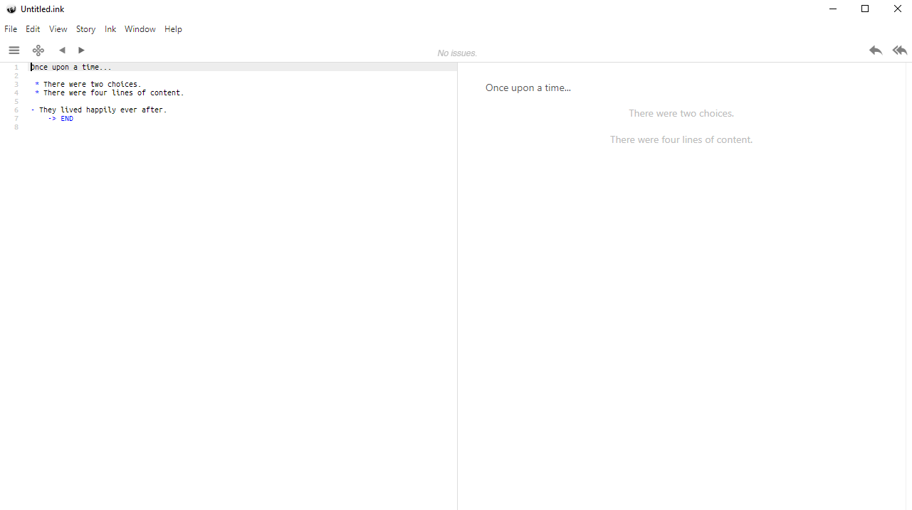

<link rel="stylesheet" href="antonio-vigilante.github.io/filosofia/assets/style.css">

## Ink

### Installazione

_Inky_, l'editor per il linguaggio Ink, può essere scaricato gratis a 🔗[questo link](https://www.inklestudios.com/ink/), in versione Mac, Windows e Linux. L'installazione è estremamente semplice. Il programma viene scaricato in formato .zip. Sarà sufficiente scompattare il contenuto in una cartella, sul Desktop o dove si preferisce, e avviare quindi il programma cliccando sul file `inky.exe`.

<figure>
  
</figure>

Il funzionamento del software è estremamente semplice: il codice viene inserito nella finestra a sinistra e sviuppato in tempo reale in quella di destra.
