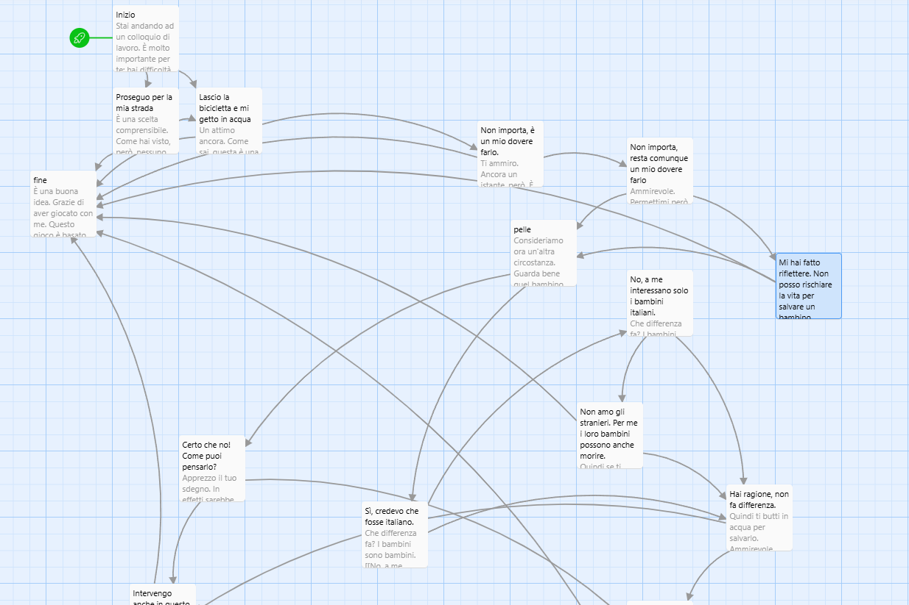
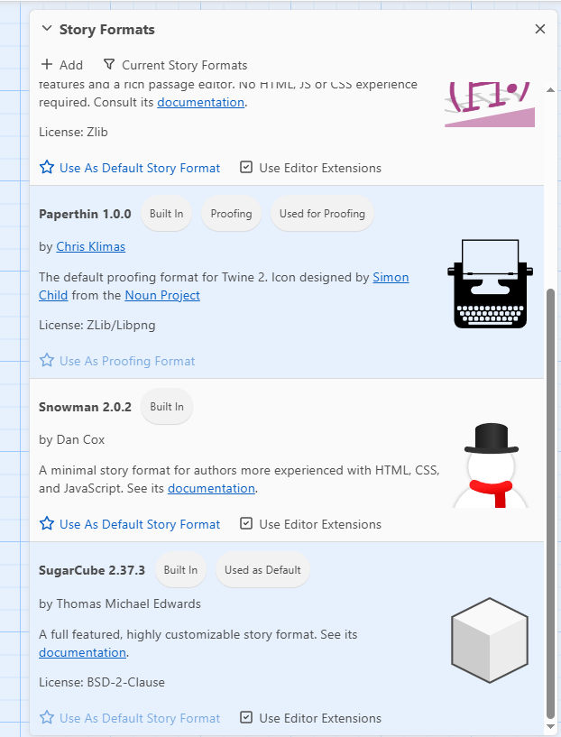
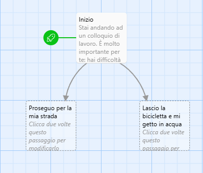

## Twine

Twine è uno strumento open source per la creazione di storie interattive e ipertestuali, sviluppato originariamente nel 2009 da Chris Klimas, scrittore e programmatore statunitense. Nato dall’esigenza di offrire a chiunque la possibilità di raccontare storie non lineari senza dover imparare a programmare, Twine si è rapidamente affermato come uno degli ambienti più accessibili e versatili nel panorama della narrativa digitale. Può essere [scaricato gratis](https://twinery.org/) oppure usato online nella [versione per browser](https://twinery.org/2/#/), senza obbligo di registrazione.

Anche in questo caso partiamo da un esempio:

🔗 [Salvare un bambino che sta annegando?](esempio--twine--01.html) [(sorgente)](esempio--twine--01.twee)  

Qui abbiamo un percorso basato sull'articolo di Peter Singer <a href="https://newint.org/features/1997/04/05/peter-singer-drowning-child-new-internationalist">The Drowning Child and the Expanding Circle</a>. La struttura è simile a quella generata da Ink, anche se compare un menu che consente di salvare i progressi e di riavviare la storia. Del tutto diversa è però la piattaforma. La storia dell'esempio sulla piattaforma web si presenta come segue.

<figure>
  
</figure>

L'interfaccia si presenta più amichevole: non dobbiamo lavorare (solo) sul codice, ma possiamo visualizzare i legami tra i diversi nodi della nostra storia interattiva.
Vediamo come procedere per creare una storia.
Per creare una nuova storia, clicchiamo sulla voce `+ New` in alto a sinistra. Ci verrà chiesto di dare un nome alla nuova storia; quindi selezioniamo `Create`. Si aprirà una schermata con un primo nodo da editare. Prima di farlo però selezioniamo il formato. Twine funziona con quattro formati (Story Formats), con differenze significative nel layout e nelle funzionalità. Noi useremo il formato SugarCube. Nel menu in alto selezioniamo quindi `Twine` e quindi, nel menu immediatamente sottostante, `Story Formats`. Si aprirà a destra questa finestra:
<figure>
  
</figure>
Nel riquadro del formato SugarCube selezioniamo `Use As Default Story Format`.
Ora possiamo occuparci del primo nodo. Cliccandovi su, entriamo nella modalità di modifica. Si apre questa finestra:

<figure>
  
</figure>

Diamo uno sguardo al menu. Intanto possiamo dare un nome al nodo, selezionando `Rinomina` o `Rename` (a seconda del browser usato il menu può essere in italiano o in inglese). Possiamo poi settare lo stile (grassetto, corsivo ecc.), il colore, i bordi e l'orientamento del testo. Le altre voci riguardano funzioni avanzate che possiamo tralasciare in questa guida essenziale.
Inseriamo dunque del testo nel primo nodo. Nel caso dell'esempio che abbiamo visto, il testo è il seguente:

```
Stai andando ad un colloquio di lavoro. È molto importante per te: hai difficoltà economiche e hai a carico tua madre, gravemente malata. Sai di avere  buone possibilitrà di superare il colloquio di lavoro.
Vai al colloquio in bicicletta, l'unico mezzo che puoi permetterti. Lungo il tragitto costeggi un lago. Ti accorgi a un certo punto di un capannello di persone. Fermi la bicicletta e chiedi cosa sta succedendo. Ti mostrano un bambino nel lago. Urla e chiede aiuto: rischia di annegare.
Tu sei fisicamente in forma e sai nuotare bene. Che fai?

[[Proseguo per la mia strada]]
[[Lascio la bicicletta e mi getto in acqua]]
```

Se ora guardiamo la board, notiamo che sono stati creati due altri nodi, collegati con frecce al nodo iniziale:

<figure>
  
</figure>

Questo è il modo, estramamente semplice, in cui in Twine si creano nuovi nodi: è sufficiente mettere il rimando tra doppie parentesi quadre: `[[testo]]`. Il nuovo nodo avrà in questo caso il nome del testo che rimanda ad esso. Nel caso del nostro esempio, i due nodi si chiamano: `Proseguo per la mia strada` e `Lascio la bicicletta e mi getto in acqua`. Questo costituisce un problema nel caso in cui a quel nodo debbano rimandare anche altri nodi, cosa che avviene spesso in una storia interattiva: in questo caso il testo di rimando dovrebbe essere lo stesso, altrimenti in link non funzionerà; ma può essere che quel testo sia inadatto al contesto del nuovo nodo. Per ovviare a questo problema possiamo stabilire un nome del nodo diverso dal testo che rimanda ad esso, come segue: `[[Testo del rimando ->nodo1]]`. Questa stringa crea un nuovo nodo al quale sarà possibile rimandare da più nodi, semplicemente indicando il nome del nodo, pur con testi del rimando diversi.


